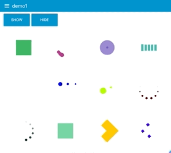
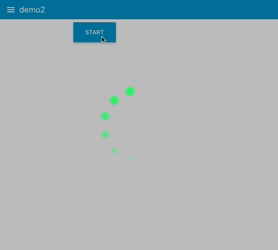

node-red-contrib-ui-spinner
===========================

A Node-RED dashboard ui node for displaying loading spinners.

## Install

Either use the Editor - Menu - Manage Palette - Install option, or run the following command in your Node-RED user directory (typically `~/.node-red`) after installing Node-RED-dashboard.

    npm i node-red-contrib-ui-spinner

## Requirements
Node-RED v19.4 or greater
Node-RED-dashboard v2.13.0 or greater

## Usage

`ui_spinner` widget displays an animated indicator on the Node-RED
dashboard.  It uses [SpinKit](https://github.com/tobiasahlin/SpinKit)
to display spinners and supports various spinner types.

## Example

There are examples that you can import from the Node-RED editor menu:

**Import > Examples > node-red-contrib-ui-spinner**
